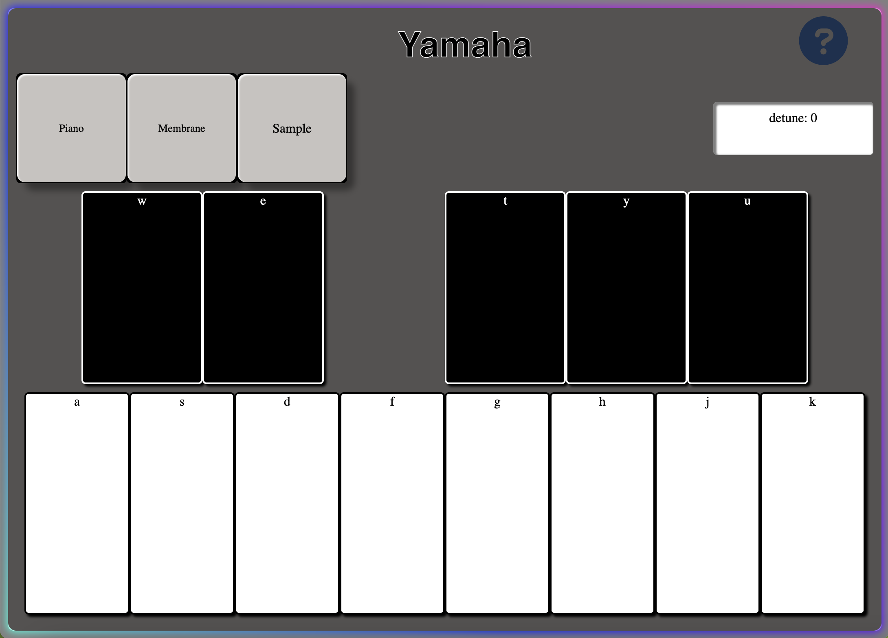

# WebPiano 🎹 – Keyboard-Based MP3 Sound Piano


## 🌐 Demo  
🔗 **Live Website:** [Try WebPiano](https://play-piano-project.onrender.com)

## 📜 Description  
**WebPiano** is a browser-based interactive piano that lets users play the digital piano directly from their keyboard.  
The app includes a built-in tuner, MP3-based sound mapping, and a membrane sound mode for deeper tones.

Users can:
- 🎹 Play melodies using their computer keyboard  
- 🎚️ Adjust the pitch and tuning for each note  
- 🎵 Upload MP3 files to turn any sound into a playable instrument  
- 🌌 Switch to a membrane synth mode for ambient sounds

I built WebPiano using **JavaScript, EJS templates, CSS3**, and **Tone.js** for audio synthesis and playback.

### 🚀 **Planned Features**
- Add sustain and reverb effects  
- Support mobile touch input  
- Enable saving and exporting custom instruments  
- Improve layout and key mapping feedback animation  

## 📸 Screenshots  


## 🛠️ Tech Stack  
- **Frontend:** CSS3, JavaScript (Vanilla)  
- **Templating Engine:** EJS  
- **Audio Engine:** Tone.js  
- **Deployment:** Render

## 📦 Installation

### Prerequisites
- Node.js (v18 or later)
- Git

### 🔧 Setup
```bash
# Clone the repository
git clone https://github.com/noonnofus/play_piano_project.git

# Navigate into the project folder
cd play_piano_project

# Install dependencies
npm install

# Start the server (e.g., using express or live-server)
npm start
```
